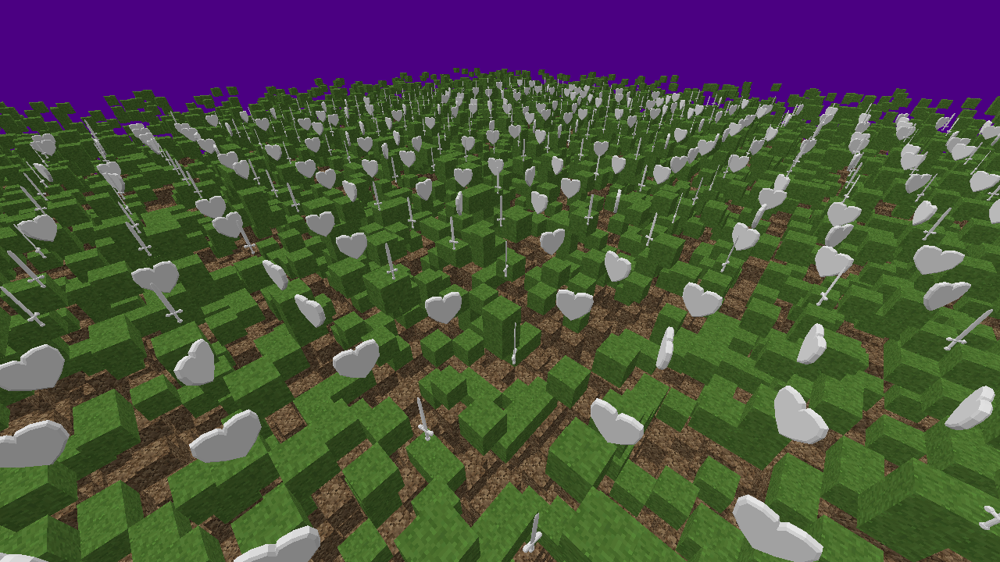

# gæmstone Game Engine

The **gæmstone** project, pronounced /ɡɛmstoʊn/ (like "gem" but with the hard G from "game"), is a 3D game engine written in C# and targeting cross-platform .NET, making heavy use of [Entity Component System (ECS)][ECS] design. It is heavily inspired by [flecs], borrowing a lot of concepts and terminology.

Core features, which have yet to be written, include:

- Incredibly modular due to ECS design
- In-game entity and component editor
- Modify and add assets and similar at runtime
- Hot reloading of code at runtime
- Multiplayer support, probably server-client
- Support for "bloxel" (Minecraft-like) games

Eventually, gæmstone is meant to become the foundation for my [own games][gaemdesign].

[ECS]: https://en.wikipedia.org/wiki/Entity_component_system
[flecs]: https://github.com/SanderMertens/flecs
[gaemdesign]: https://github.com/copygirl/gaemdesign
